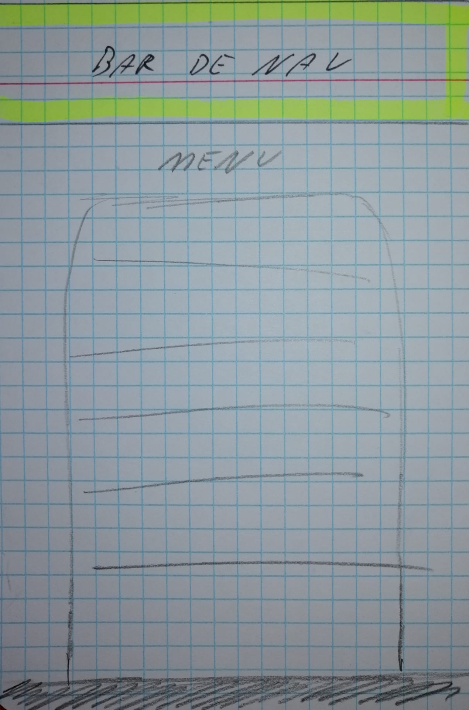

# restaurant-css-framework

## La boustifaille

Le projet _"restaurant-css-framework"_ etait de mettre en place un site web pour notre restaurant avec le framework Bootsrap, vous pouvez retrouver toutes les conditions juste [ici.](https://github.com/becodeorg/BXL-Swartz-4-27/blob/master/1.The-Field/6.Bootstrap/restaurant.adoc)

Vous l'aurez surement deviné par le titre, mon restaurant se prénome "**La boustifaille**".

La création du site s'est déroulée en plusieurs étapes: 
1. L'analyse des éléments devants être présent sur le site.
2. Une phase d'élaboration de croquis afin d'avoir une idée claire de comment vont être présenté les pages.
3. La mise en place du squelette avec HTML **et** Bootstrap.
4. La mise en page avec le CSS.

 

Vous trouverez juste en dessous les 5 pages présentes sur le site ainsi que son croquis réalisé en début de projet.

- - - - - -
**Attention**: tous les croquis montrés ici sont adaptés pour des écrans sm-md-lg. Pour les écrans de taille xl-xxl la structure restera sensiblement la même sauf que les éléments seront "ajustés" afin de rendre le visuel plus estéthique.
- - - - 
 
 

### Page 1: "Home"

 > Nous pouvons voir en haut le "header" contenant le logo sur la gauche, le titre sur la droite et les liens de page au niveau de la "Bar de navigation". Il est important de noté que ce header restera le même sur toutes les pages du site. Il en est de même pour le "footer" qui est fixé en bas de page, représenté par la bar grise.

 Sur cette première page nous retrouverons un "jumbotron" et 2 "panels", l'idée était de centrer le jumbotron et de placer en décalé les deux panels en fin de page. 
 Un bouton "réserver" à également été implenté dans la page, juste en dessous du jumbotron.

 
 

### Page 2: "About"

 
Sur cette page ci nous retrouvons toutes les données rélatives au restaurant.
 * Une présentation de qui nous sommes.
 * Une carte montrant l'adresse du restaurant (dessinée par mes soins).
 * l'adresse du restaurant en fin de page 

 
 

### Page 3: "Menu"

La page du menu est très simple, elle est constituée de 2 cartes. 
 * Carte des plats.
 * Carte des desserts.
La carte à été faite grâce au format _grouped list_, elle comporte également des badges pour mettre en avant les nouveautés/coup de coeur/etc...

 
 

### page 4: "Gallery"
 

> pour la page "gallery" on aura 2 croquis. 
> La première pour les écrans allant jusqu'à 768px, et la deuxième pour les écrans supérieurs à 768px.

 

Sur cette page ci nous retrouverons un système de _pagination_ composé de 3 pages avec 3 photos sur chacune d'elle, excepté pour la dernière page ou nous retrouverons 4 photos, ce qui nous fait un total de 10 photos.
Pour les écrans allant jusqu'à 768px les photos seront disposées comme sur le croquis, les unes au dessus des autres.

 

Lorsque l'écran passe à une taille supérieure à 768px, la disposition des photos sera différente, comme montré sur le croquis juste en dessous.

 
 

### Page 5: "Contact"

 

Comme 5ème et dernière page nous retrouvons la page "Contact".

Sur la page _contact_ nous avons un formulaire comportant:
 * Nom
 * Prénom
 * E-mail
 * Un _drop-down-list_ pour choisir le sujet du message
 * Textarea pour écrire son message
 * Bouton _submit_ sous forme d'icon